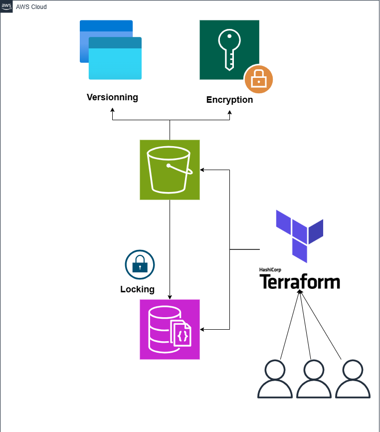
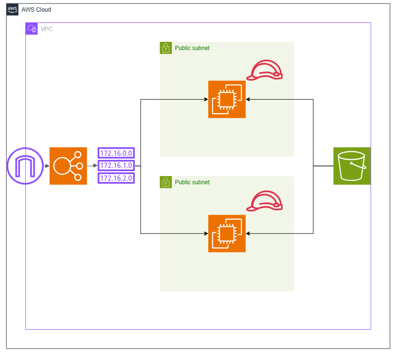

# Terraform Projects: State Management & VPC Setup

This repository contains two quick Terraform projects designed to demonstrate foundational AWS infrastructure as code best practices:

1. **Terraform State Management** — Backend configuration using AWS S3 and DynamoDB
2. **AWS VPC Setup** — A complete VPC environment setup including subnets, route tables, NAT Gateway, and more

---

## 📁 Project Structure

``` bash
terraform-projects/
│
├── 1-state-management/
│ ├── main.tf
│ └── backend.tf
│
├── 2-vpc-setup/
│ ├── main.tf
│ ├── variables.tf
│ └── provider.tf
│
└── README.md
```

## 🗂 1. Terraform State Management (S3 + DynamoDB)

> This project demonstrates how to configure remote Terraform state using **Amazon S3** and implement state locking with **DynamoDB**.

### 🧠 Architecture Overview



### 🔧 Resources Created

- S3 bucket for remote state storage
- DynamoDB table for state locking and consistency

### 📦 Files

- `main.tf`: Creates the S3 bucket and DynamoDB table
- `backend.tf`: Configures Terraform to use S3 + DynamoDB backend

### ▶️ Usage

```bash
cd State_File_Management

terraform init
terraform apply
```

## 🌐 1. Terraform State Management AWS VPC Setup

This project sets up a complete VPC architecture ready for deployment of services.

### 🧠 Architecture Overview



### 🔧 Resources Created

- VPC  
- Public subnets across 2 AZs  
- Internet Gateway (IGW)
- Route Tables  
- Security Groups
- EC2 instances
- ALB application load Balancer

### 📦 Files

- `main.tf`: Defines all infrastructure components  
- `variables.tf`: Customizable variables  
- `provider.tf`: provider data

### ▶️ Usage

```bash
cd 2-vpc-setup

terraform init
terraform apply
```

## 🧰 Prerequisites

- [Terraform CLI](https://developer.hashicorp.com/terraform/downloads) version `>= 1.0`
- [AWS CLI](https://docs.aws.amazon.com/cli/latest/userguide/install-cliv2.html) configured with `aws configure`
- Proper IAM permissions to create AWS resources, including:
  - VPC
  - EC2
  - Internet Gateway (IGW)
  - ALB
  - Subnets
  - Route Tables
  - Security Groups
  - Dynamo DB
  - S3 Bucket

## 🔐 Security Note

> **Never commit sensitive credentials** (e.g., AWS access keys) to version control.  
> Use environment variables, `.tfvars` files (added to `.gitignore`), or a secrets manager to securely manage sensitive data.
